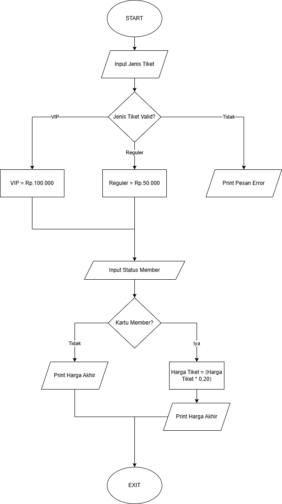
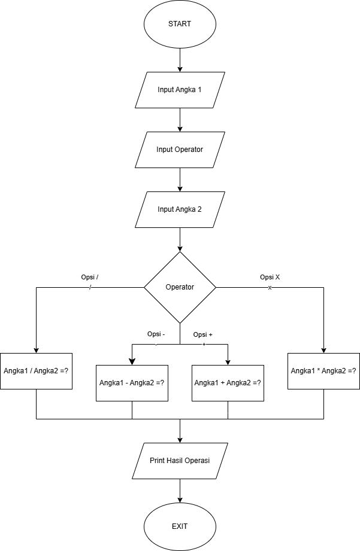

# Sistem Pembelian Tiket
Program sederhana untuk menghitung harga tiket berdasarkan jenis tiket dan status member.

## Deskripsi Program
Program ini memungkinkan pengguna untuk:

Memilih jenis tiket (VIP/Reguler) Menentukan status member Mendapatkan perhitungan total harga tiket dengan diskon jika sudah bergabung menjadi member

## Flowchart Ticket




## Code Tiket Bioskop

````
reguler = 50000
vip = 100000
discount = 0.2

tipe_tiket = input('tipe tiket(reguler/vip :)' )
status_member = input('apakah mempunyai member(iya/tidak :)')

if tipe_tiket == 'reguler':
  harga_tiket = reguler
elif tipe_tiket == 'vip':
  harga_tiket = vip 
else : 
  print('tiket tidal valid')
  exit()
  
if status_member == 'iya':
  harga_tiket = harga_tiket - (harga_tiket * discount)

print(f'total harga yang harus di bayar {harga_tiket}')
````

## Penjelasan Code

Penjelasan codingan di atas adalah dimana ada 2 buah tiket yang satu "reguler" kemudian yang ke dua "vip" dan ada discount bagi yang berlangganan sebesar 20%. setiap tiket memiliki harga yang berbeda yang dimana untuk harga teket sebagai berikut,

tiket reguler : 50.000
tiiket vip : 100.000
Untuk setiap pembelian akan di kenakan discount member sebesar 20% tetapi jika tidak memiliki member maka harga yang harus di bayar adalah harga yang tertera di atas. jika membeli tiket dan memiliki member discount sebagai berikut,

tiket reguler : 50.000 * 20%
              : 40.00
tiket vip     : 100.000 * 20%
              : 80.000

## Contoh Output Code

````
tipe tiket(reguler/vip):reguler
apakah mempunyai member(iya/tidak):tidak
total harga yang harus di bayar 50000

tipe tiket(reguler/vip):reguler
apakah mempunyai member(iya/tidak):iya
total harga yang harus di bayar 40000.0

tipe tiket(reguler/vip):vip
apakah mempunyai member(iya/tidak):tidak
total harga yang harus di bayar 100000

tipe tiket(reguler/vip):vip
apakah mempunyai member(iya/tidak):iya
total harga yang harus di bayar 80000.0
````

## Cara Kerja Code

### Program menentukan harga awal:
- Tiket VIP: Rp 100.000
- Tiket Reguler: Rp 50.000
  
### User diminta memilih jenis tiket:
- Jika memilih "vip", harga diset Rp 100.000
- Jika memilih "reguler", harga diset Rp 50.000
- Jika input selain keduanya, program berhenti dengan pesan "Input tidak valid"

### User diminta konfirmasi kepemilikan kartu member:
- Jika memiliki kartu member (input "ya"), akan mendapat diskon 20%
- Jika tidak memiliki (input "tidak"), tidak ada diskon
- Program menampilkan harga akhir setelah perhitungan diskon

## Contoh perhitungan:

Jika pilih VIP dan punya member: Rp 100.000 - (20% × Rp 100.000) = Rp 80.000
Jika pilih Reguler dan punya member: Rp 50.000 - (20% × Rp 50.000) = Rp 40.000
Program Kalkulator Sederhana
Program kalkulator sederhana untuk menghitung inputan dari user.

## Deskripsi Program
Program kalkulator sederhana yang mampu melakukan operasi dasar matematika dengan dua bilangan, user bisa memilih operasi yang ingin mereka lakukak (+, -, *, /).

## Flowchart Kalkulator




## Cara Kerja Program

````
print('-----------------------------KALKULATOR NAUFAL-----------------------------')

#input user
angka1 = int(input("masukan angka: "))
opsi = input('pilih opsi (+, -, *, /) : ')
angka2 = int(input("masukan angka: "))

#opsi
opsi_plus = angka1 + angka2
opsi_minus = angka1 - angka2
opsi_kali = angka1 * angka2
opsi_bagi = angka1 / angka2

print('-----------------------------HASILNYA DIBAWAH-----------------------------')

#logika program
if opsi == '+':
    print('hasilnya adalah : ' + str(opsi_plus))
elif opsi == '-':
    print('hasilnya adalah : ' + str(opsi_minus))
elif opsi == '*':
    print('hasilnya adalah : ' + str(opsi_kali))
elif opsi == '/':
    print('hasilnya adalah : ' + str(opsi_bagi))
    print('jika dibulatkan menjadi : ' + str(round(opsi_bagi)))
````

## Contoh Output Code

### Operasi Penjumlahan
````
-----------------------------KALKULATOR NAUFAL-----------------------------
masukan angka: 1607  
pilih opsi (+, -, *, /) : +
masukan angka: 4
-----------------------------HASILNYA DIBAWAH-----------------------------
hasilnya adalah : 1611
````

### Operasi Pengurangan
````
-----------------------------KALKULATOR NAUFAL-----------------------------
masukan angka: 1607
pilih opsi (+, -, *, /) : -
masukan angka: 4
-----------------------------HASILNYA DIBAWAH BOS-----------------------------
hasilnya adalah : 1603
````

### Operasi Perkalian
````
-----------------------------KALKULATOR NAUFAL-----------------------------
masukan angka: 1607
pilih opsi (+, -, *, /) : *   
masukan angka: 4
-----------------------------HASILNYA DIBAWAH BOS-----------------------------
hasilnya adalah : 6428
````

### Operasi Pembagian
````
-----------------------------KALKULATOR NAUFAL-----------------------------
masukan angka: 1607
pilih opsi (+, -, *, /) : /
masukan angka: 4
-----------------------------HASILNYA DIBAWAH BOS-----------------------------
hasilnya adalah : 401.75
jika dibulatkan menjadi : 402
````

## Cara Kerja Code

- Program meminta input angka pertama.
- Program meminta input operator matematika.
- Program meminta input angka kedua.
- Fungsi kalkulator() memproses input sesuai operator.
- Menampilkan hasil perhitungan.
